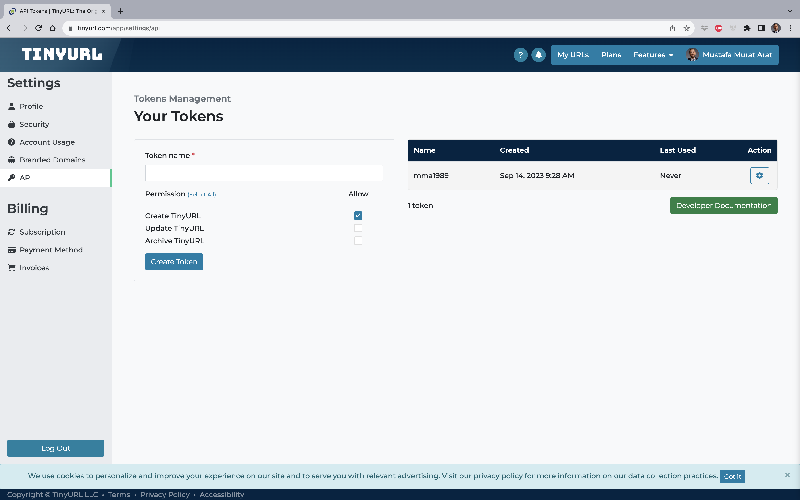

The TinyURL API allows you to programmatically access their service to shorten long URLs into TinyURLs. 
https://tinyurl.com/app/dev

TinyURL API is only available to authorized users. It requires an API token that is used for http bearer authentication as described in the OpenAPI specification. To create an API token for TinyURL, please login to your account and visit API Settings (https://tinyurl.com/app/settings/api). 

This token should be kept secret to prevent unauthorized use of your account. 

If you lose your token or believe that it may have been stolen, please remove the old token and create a new one.

Change `YOUR_URL` with the URL you wanrt to shorten and `YOUR_API_KEY` with the key you created on your account!

